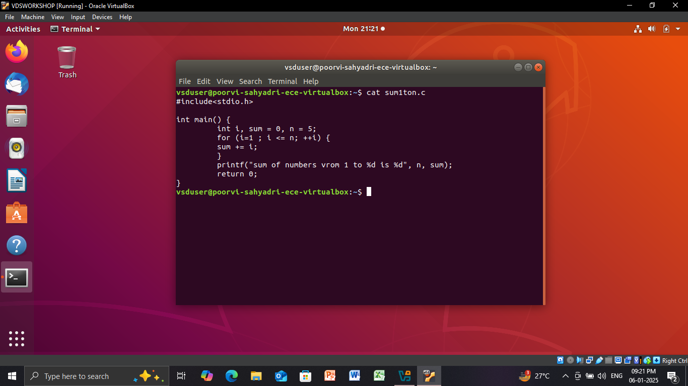
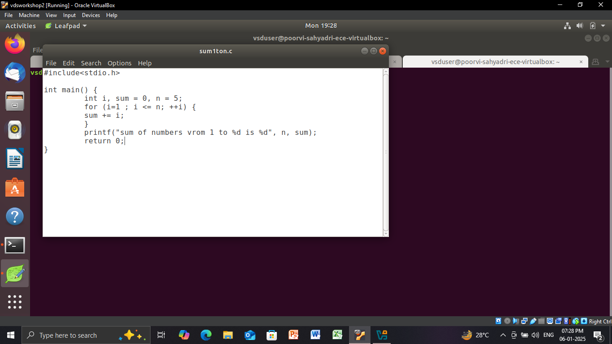
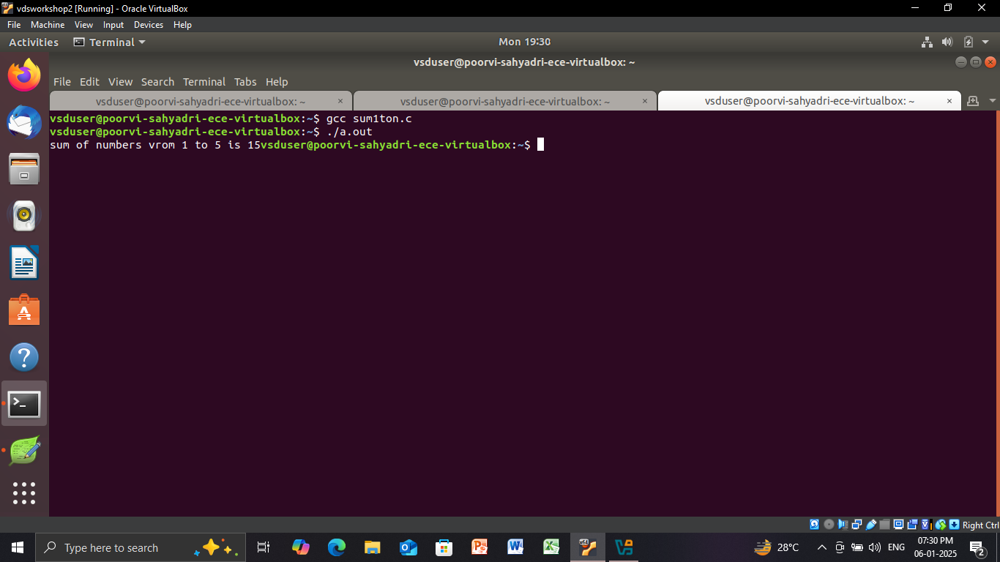

## **RISC-V TALENT DEVELOPMENT PROGRAM POWERED BY SAMSUNG AND VSD**  
The **RISC-V Talent Development Program** is an initiative by **Samsung Semiconductor India Research (SSIR)** in collaboration with **VLSI System Design (VSD)**. This program aims to nurture and develop skilled professionals in **RISC-V architecture**, providing hands-on experience and industry-relevant training.

---

### **ABOUT ME**  
- **Name:** Poorvi S Shetty  
- **College:** Sahyadri College of Engineering & Management, Mangaluru  
- **Email ID:** shettypoorvi38@gmail.com  
- **GitHub Profile:** [Poorvi-Sahyadri-ECE](https://github.com/Poorvi-Sahyadri-ECE)  
- **LinkedIn Profile:** Poorvi Shetty  

---

<details>
<summary>Task 1: Development of C Based Lab</summary>







       
</details>
<details>
<summary>Task 2: Simulation with Spike</summary>
       
</details>
<details>
<summary>Task 3: Identification of RISC-V Instructions</summary>
        
<summary>1. addi sp, sp, -32</summary>

Opcode(ADDI): 0010011  
Immediate: -32 = 11111111111111100000 (12 bits)  
Registers: sp(rd) = 00010, sp(rs1) = 00010  

| imm[11:0]       | rs1    | funct3 | rd    | opcode  |
|------------------|--------|--------|-------|---------|
| 111111100000     | 00010  | 000    | 00010 | 0010011 |

---
<summary>2. sd ra, 24(sp)</summary>

Opcode(SD): 0100111  
Immediate: 24 (split into two parts: imm[11:5] and imm[4:0])  
Registers: rs1 = sp = 00010, rs2 = ra = 00001  

| imm[11:5] | rs2   | rs1   | funct3 | imm[4:0] | opcode  |
|-----------|-------|-------|--------|----------|---------|
| 0000000   | 00001 | 00010  | 011    | 11000    | 0100111 |

---

<summary>3. jal ra, 10448</summary>

Opcode(JAL): 1101111  
Immediate: 10448  
Register (rd): ra = 00001  

| imm[20] | imm[10:1] | imm[11] | imm[19:12] | rd    | opcode  |
|---------|-----------|---------|------------|-------|---------|
|   0    | 0010100000 |    0    | 10100000   | 00001 | 1101111 |

---

<summary>4. ld ra, 24(sp)</summary>

Opcode(LD): 0000011  
Immediate: 24  
Registers: rd = ra = 00001, rs1 = sp = 00010  

| imm[11:0]      | rs1   | funct3 | rd    | opcode  |
|-----------------|-------|--------|-------|---------|
| 000000011000    | 00010 | 011    | 00001 | 0000011 |

---

<summary>5. lw a1, 8(sp)</summary>

Opcode(LW): 0000011  
Immediate: 8  
Registers: rd = a1 = 01011, rs1 = sp = 00010  

| imm[11:0]      | rs1   | funct3 | rd    | opcode  |
|-----------------|-------|--------|-------|---------|
| 000000001000    | 00010 | 010    | 01011 | 0000011 |

---

<summary>6. li a0, 0</summary>

Opcode(ADDI): 0010011  
Immediate: 0  
Registers: rd = a0 = 01010, rs1 = x0 = 00000  

| imm[11:0]     | rs1   | funct3 | rd    | opcode  |
|---------------|-------|--------|-------|---------|
| 000000000000  | 00000 | 000    | 01010 | 0010011 |

---

<summary>7. jalr x0, 0(ra)</summary>

| imm[11:0]     | rs1   | funct3 | rd    | opcode  |
|---------------|-------|--------|-------|---------|
| 000000000000  | 00001 | 000    | 00000 | 1100111 |

---

<summary>8. addi a0, a0, -920</summary>

Opcode(ADDI): 0010011  
Registers: rd = a0 = 01010, rs1 = a0 = 01010  
Immediate: -920 = 110001101000 (sign-extended 12-bit value)  

| imm[11:0]     | rs1   | funct3 | rd    | opcode  |
|---------------|-------|--------|-------|---------|
| 110001101000  | 01010 | 000    | 01010 | 0010011 |

---

<summary>9. sd s0, 16(sp)</summary>

Opcode(SD): 0100111  
Registers: rs1 = sp = 00010, rs2 = s0 = 01000  
Immediate: 16 (split into imm[11:5] and imm[4:0])  
imm[11:5] = 0000000, imm[4:0] = 10000  

| imm[11:5]     | rs2   | rs1   | funct3 | imm[4:0] | opcode  |
|---------------|-------|-------|--------|----------|---------|
| 0000001       | 01000 | 00010 | 011    | 10000    | 0100111 |

---

<summary>10. lw a5, 12(sp)</summary>

Opcode(LW): 0000011  
Registers: rd = a5 = 01000, rs1 = sp = 00010  
Immediate: 12 = 000000001100  

| imm[11:0]     | rs1   | funct3 | rd    | opcode  |
|---------------|-------|--------|-------|---------|
| 000000001100  | 00010 | 010    | 01000 | 0000011 |

---

<summary>11. add a1, a1, a5</summary>
Opcode: 0110011

| funct7   | rs2   | rs1   | funct3 | rd    | opcode  |
|----------|-------|-------|--------|-------|---------|
| 0000000  | 01000 | 01011 | 000    | 01010 | 0110011 |

---

<summary>12. add a0, a1, a5</summary>

Opcode(ADD): 0110011  
Registers: rd = a0 = 01010, rs1 = a1 = 01011, rs2 = a5 = 01000  
Funct3: 000  
Funct7: 0000000  

| funct7   | rs2   | rs1   | funct3 | rd    | opcode  |
|----------|-------|-------|--------|-------|---------|
| 0000000  | 01000 | 01011 | 000    | 01010 | 0110011 |

---

<summary>13. addw a1, a1, a5</summary>

Opcode(ADDW): 0111011  
Registers: rd = a1 = 01011, rs1 = a1 = 01011, rs2 = a5 = 01000  
Funct3: 000  
Funct7: 0000000  

| funct7   | rs2   | rs1   | funct3 | rd    | opcode  |
|----------|-------|-------|--------|-------|---------|
| 0000000  | 01000 | 01011 | 000    | 01011 | 0111011 |

---
<summary>14. lui a0, 0x2b</summary>

Opcode(LUI): 0110111  
Immediate (0x2b << 12): 0000000000101011  
Register (rd): a0 = 01010  

| imm[31:12]      | rd      | opcode  |
|------------------|---------|---------|
| 0000000000101011 | 01010   | 0110111 |

 ---                   
<summary> 15. li a0,0</summary>

|imm[11:0] | 	rs1 	|funct3 |	 rd   	|opcode |
|----------|-------|-------|--------|-------|
|000000000000|	00000	|000	|01010	|0010011|
---
</details>
<details>
<summary>Task 4: Functional Simulation of RISC-V Core</summary>
</summary> 
<br>
Steps to perform functional simulation of RISCV

1. Download Files:
Download the code from the reference github repo.

2. Set Up Simulation Environment:
Install iverlog using commands:

        sudo apt install iverilog
        sudo apt install gtkwave

3. To run and simulate the verilog code, enter the following command:

        iverilog -o iiitb_rv32i iiitb_rv32i.v iiitb_rv32i_tb.v
        ./iiitb_rv32i

4. To see the simulation waveform in GTKWave, enter the following command:

        gtkwave iiitb_rv32i.vcd
</details>
<details>
<summary>Task 5: Project Implementation</summary>
       
**Overview: SOS Morse Code Blinker Using LED**  

This project creates an **SOS Morse Code signal** using an **LED** and a **VSDSquadron Mini (CH32V003)** microcontroller. The LED blinks in the standard **Morse Code pattern** (`· · · — — — · · ·`), which is widely recognized as a distress signal.  

The microcontroller controls the LED by turning it **ON and OFF at precise intervals** to match the Morse Code sequence. This project demonstrates **basic microcontroller programming, GPIO control, and timing functions**.  

**Use Case:**  
- Emergency signaling  
- Learning Morse Code  
- Understanding microcontroller-based LED control  

---

** SOS Morse Code Blinker Using LED**  

---

**Components Required**  
| **Component**       | **Quantity** |  
|---------------------|-------------|  
| **VSDSquadron Mini (CH32V003)** | 1 |  
| **LED (Any color)** | 1 |  
| **220Ω Resistor** | 1 |  
| **Jumper Wires** | 2 |  
| **USB Type-C Cable** | 1 |  

---

**Hardware Connection**  
1. **Connect the LED Anode (+) to PD0** through a **220Ω resistor**.  
2. **Connect the LED Cathode (-) directly to GND**.  

---

**Pin-to-Pin Connection Table**  
| **Component**       | **VSDSquadron Mini Pin** | **Connection Details** |  
|---------------------|----------------------|-----------------|  
| **LED Anode (+)**   | **PD0**  | Connect through **220Ω resistor** |  
| **LED Cathode (-)** | **GND**  | Connect directly to **GND** |  
| **220Ω Resistor**   | **Between PD0 & LED Anode** | Limits current to protect LED |  

---
</details>
<details>
<summary>Task 6: Project Demonstration</summary>
**Circuit Vedio Demonstration**
       
**SOS Morse-Code Blinker: Code**
       ```
       #include <ch32v00x.h>

#define LED_PIN GPIO_Pin_0  // PD0 for LED

// Proper Delay Function
void Delay_ms(uint32_t ms) {
    volatile uint32_t count;
    while (ms--) {
        for (count = 0; count < 4800; count++) {
            // Just an empty loop to create delay (NO assembly)
        }
    }
}

// Function to blink LED for a given duration
void blink(int duration) {
    GPIO_WriteBit(GPIOD, LED_PIN, Bit_SET);
    Delay_ms(duration);
    GPIO_WriteBit(GPIOD, LED_PIN, Bit_RESET);
    Delay_ms(200);  // Short pause between blinks
}

void setup() {
    RCC_APB2PeriphClockCmd(RCC_APB2Periph_GPIOD, ENABLE);

    GPIO_InitTypeDef GPIO_InitStructure;
    GPIO_InitStructure.GPIO_Pin = LED_PIN;
    GPIO_InitStructure.GPIO_Mode = GPIO_Mode_Out_PP;
    GPIO_InitStructure.GPIO_Speed = GPIO_Speed_50MHz;
    GPIO_Init(GPIOD, &GPIO_InitStructure);
}

void loop() {
    while (1) {
        // S = · · · (3 short blinks)
        blink(200);
        blink(200);
        blink(200);

        Delay_ms(400); // Pause between S and O

        // O = — — — (3 long blinks)
        blink(600);
        blink(600);
        blink(600);

        Delay_ms(400); // Pause between O and S

        // S = · · · (3 short blinks)
        blink(200);
        blink(200);
        blink(200);

        // Longer Pause before repeating
        Delay_ms(2000);
    }
}

// Ensure main() is correctly defined
int main(void) {
    setup();
    loop();
    return 0;
} 

</details>
